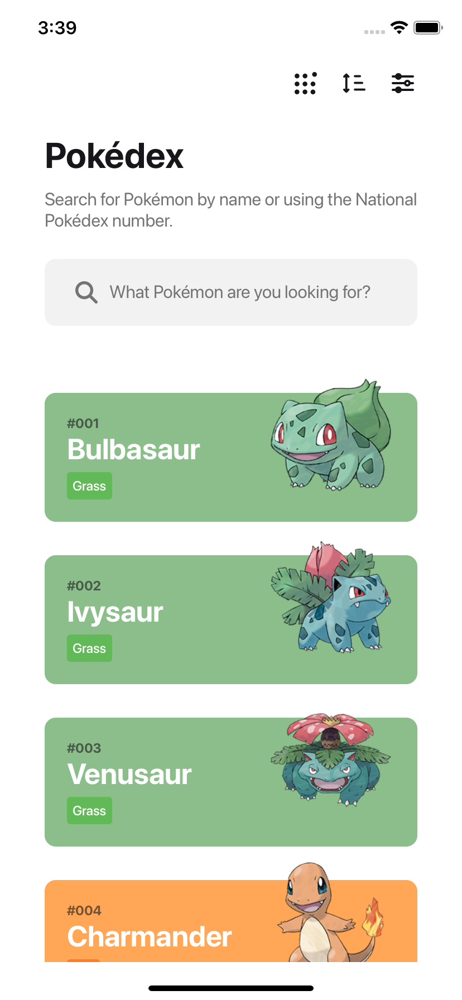
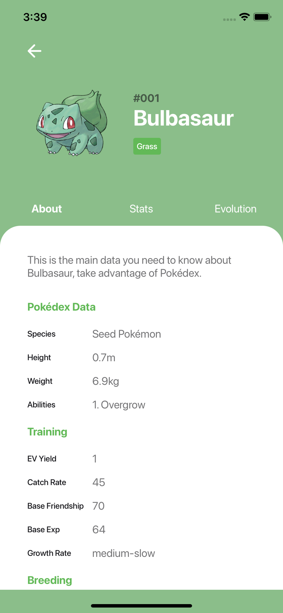
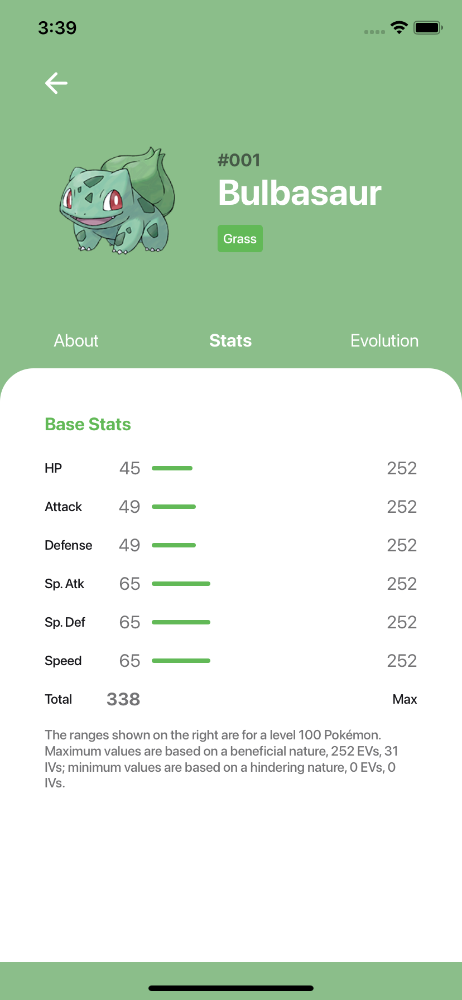
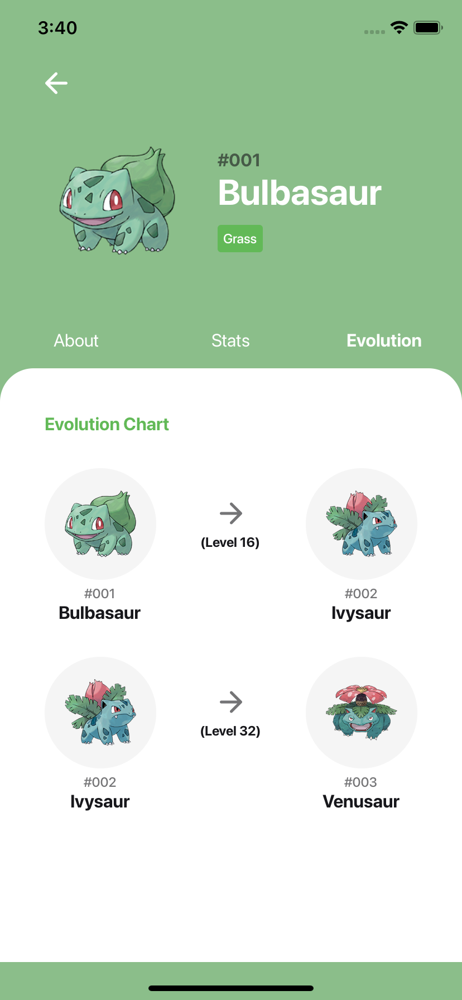

<h1 align="center">
  React Native Application for Pokédex project
</h1>

<h1 align="center">
  
  
  
  
</h1>


## 📘 About the project

I'm consuming the following **API** to receive information from pokemon: https://pokeapi.co/

## 💻 Getting started


**Clone the project and access the folder**

```bash
$ git clone https://github.com/guibsonarc/pokedex-react-native.git
$ cd pokedex-react-native
```

**Follow the steps below**

```bash
# Install the dependencies
$ yarn

# If you are going to emulate with android, run this command
# Be sure to have the emulator open
$ yarn android

# If you are going to emulate with ios, run this command
$ yarn ios
```

<h1></h1>
<h4 align="center">
    Made by <a href="https://www.linkedin.com/in/guibsonarc/" target="_blank">Guibson Arcebispo</a>
</h4>
